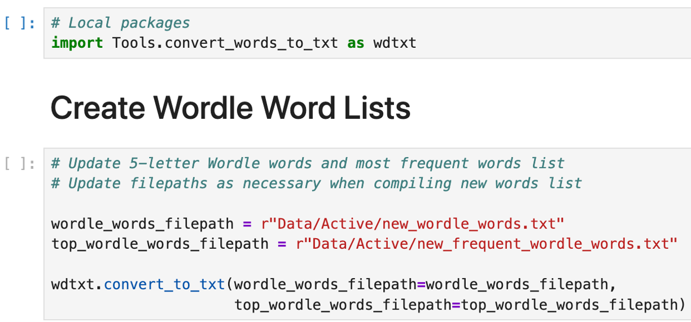
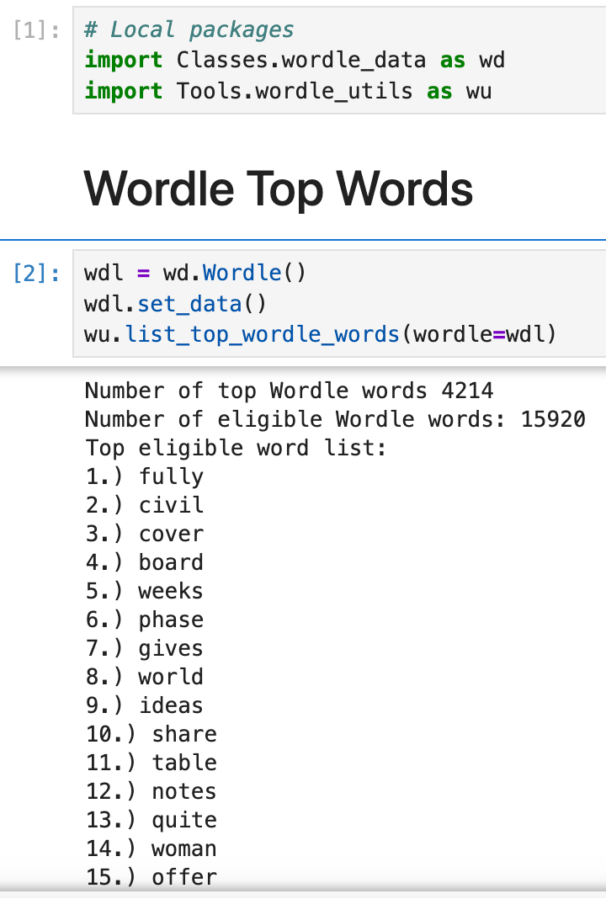
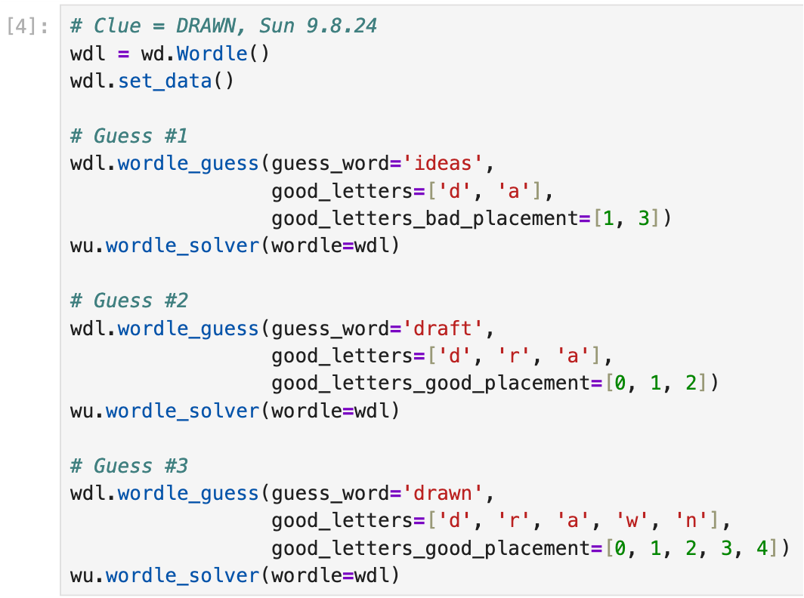
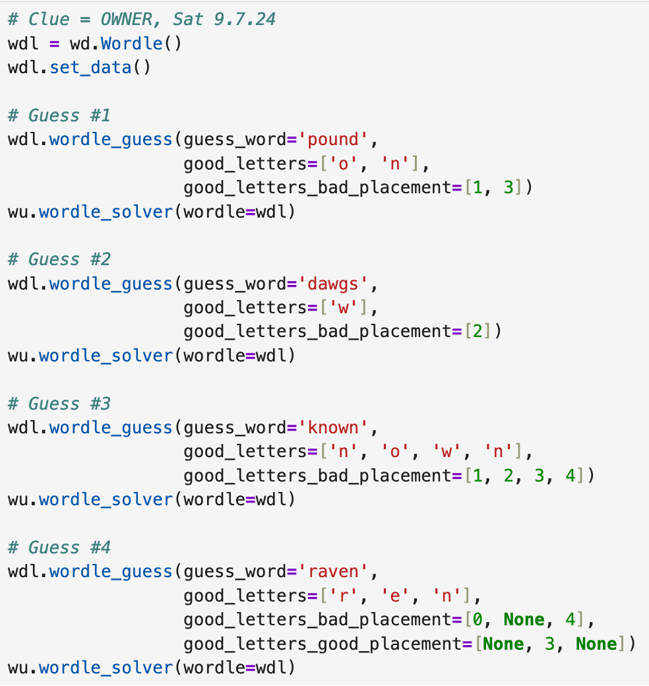
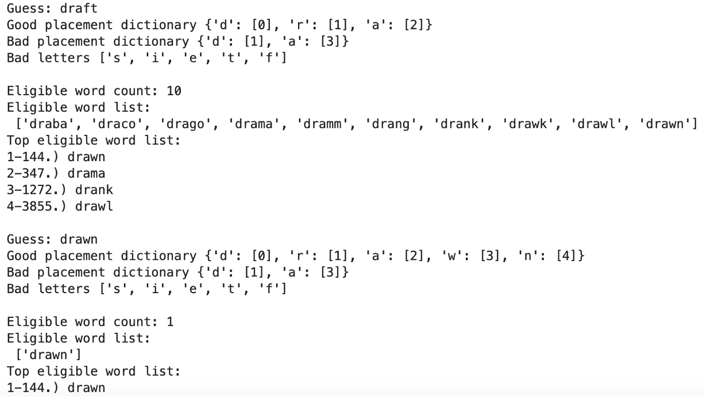

# Wordle Solver

This is a NLP-adjacent project that can be used to support your daily Wordle clue guesses.  Each time you make a guess, you can add the result to "Wordle Notebook" to improve your chances at guessing the correct 5-letter word by using Wikipedia's most frequent words list.

# Step-by-Step

### Wordle Word List

In order to generate a new word list (already included in Data/Active) you can follow the process in the "Create Wordle Word Txt Files" notebook by running these 2 cells.


### Wordle Top Words

To determine the most frequently used 5-letter words, run the first 2 cells in "Wordle Notebook".


### Wordle Guess
To play the Wordle game with a 5-letter word guess, follow the examples in "Wordle Notebook".  See this example for the 9.8.25 clue.



1. You need to start by declaring a Wordle object and using the set_data() function.
2. Submit a guess in the Wordle game (e.g. "ideas") and provide the guess in the wordle_guess() function using "guess_word" parameter.
3. Include which letters are correct by in the "good_letters" parameter.
4. For the correct letters with incorrect placement, include their positions under the "good_letters_bad_placement" parameter (0-based indexing, [0,1,2,3,4])
5. For the correct letters with correct placement, include their positions under the "good_letters_good_placement" parameter (0-based indexing, [0,1,2,3,4])
6. If you have a combination of correct letters in both incorrect and correct placements, provide a "None" value when the good letter entry doesn't apply to the good placement or the bad placement list (see example below for 4th guess on 9.7.25 clue).


Here's the result of the last 2 guesses for the 9.8.25 clue:


## Conda environment

When setting up the project, consider using a conda environment to isolate the required packages.

1. Create new conda environment (you can also use PyCharm's interpreter settings to create your conda environment instead of using command line here)
```commandline
conda env create --name wordle-solver
```
2. Add packages to conda
```commandline
conda install conda-forge::wordfreq -y
conda install conda-forge::streamlit -y
```
3. Set up jupyter for conda environment ([sauce](https://stackoverflow.com/questions/39604271/conda-environments-not-showing-up-in-jupyter-notebook))
```commandline
pip install jupyter ipykernel
```
```commandline
python -m ipykernel install --user --name wordle-solver --display-name "wordle-solver"
```

## Streamlit Deployment
1. Create requirements list.  Prune as needed.
```commandline
pip list --format=freeze > requirements.txt
```
2. Test minimal environment
```commandline
python -m venv test_env
source test_env/bin/activate
pip install -r requirements.txt
streamlit run streamlit_app.py
```
3. Delete test environment
```commandline
deactivate
rm -rf test_env
```